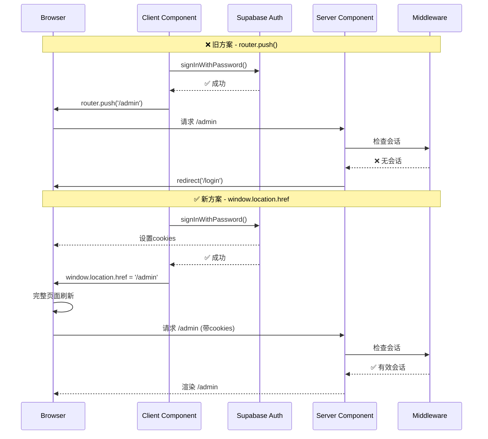

# 🔧 登录循环问题修复报告 / Login Loop Fix Report

**日期 / Date:** 2025-12-25
**问题 / Issue:** 登录后一直重定向回登录页 / Login redirect loop
**状态 / Status:** ✅ 已修复 / FIXED

---

## 🐛 问题描述 / Problem Description

### 用户反馈 / User Feedback
> "LONGIN 以后一直让我login,有bug吧"
>
> Translation: "After logging in, it keeps asking me to login, there's a bug right?"

### 症状 / Symptoms
1. 用户输入正确的邮箱和密码 / User enters correct email and password
2. 点击登录按钮 / Clicks login button
3. 页面跳转到 `/admin` / Page navigates to `/admin`
4. **立即被重定向回 `/login`** / **Immediately redirected back to `/login`**
5. 无限循环 / Infinite loop

---

## 🔍 根本原因 / Root Cause

### 技术分析 / Technical Analysis

在 Next.js 15 App Router 中使用 Supabase 认证时，会话cookie的设置是**异步**的。问题出现在以下流程：

When using Supabase auth with Next.js 15 App Router, session cookies are set **asynchronously**. The issue occurs in this flow:

```typescript
// ❌ 问题代码 / PROBLEMATIC CODE
const { data } = await supabase.auth.signInWithPassword({ email, password });

if (data.user) {
  router.push('/en/admin');  // Client-side navigation
}
```

**问题流程 / Problem Flow:**

1. ✅ `signInWithPassword()` 成功 / succeeds
2. ⚠️ Cookies **尚未**完全写入浏览器 / Cookies **not yet** fully written to browser
3. ❌ `router.push('/admin')` 客户端导航开始 / Client-side navigation starts
4. ❌ Server Component `/admin/page.tsx` 调用 `requireParent()` / calls `requireParent()`
5. ❌ `getUser()` 检查会话 → **找不到cookie** / checks session → **no cookies found**
6. ❌ 重定向到 `/login` / Redirects to `/login`

### 代码位置 / Code Location

**`lib/auth.ts:27-35`** - 认证检查 / Auth check:
```typescript
export async function requireAuth(locale: string = "en") {
  const user = await getUser();  // ← 这里检查会话 / Session check here

  if (!user) {
    redirect(`/${locale}/login`);  // ← 没有会话就重定向 / No session = redirect
  }

  return user;
}
```

**`app/[locale]/(parent)/admin/page.tsx:12`** - 受保护的页面 / Protected page:
```typescript
export default async function AdminDashboard({ params }) {
  const user = await requireParent(locale);  // ← 检查认证 / Auth check
  // ...
}
```

---

## ✅ 解决方案 / Solution

### 修复策略 / Fix Strategy

使用 `window.location.href` 替代 `router.push()` 进行**硬导航**（完整页面刷新），确保：

Use `window.location.href` instead of `router.push()` for **hard navigation** (full page refresh) to ensure:

1. ✅ Cookies 完全写入浏览器 / Cookies fully written to browser
2. ✅ Server Components 重新执行 / Server Components re-execute
3. ✅ 中间件重新运行并读取新的session / Middleware re-runs and reads new session
4. ✅ `requireAuth()` 能够找到有效会话 / `requireAuth()` finds valid session

### 代码修改 / Code Changes

#### 1. 修复 LoginForm.tsx

**修改前 / Before:**
```typescript
if (data.user) {
  const { data: userData } = await supabase
    .from("users")
    .select("role")
    .eq("id", data.user.id)
    .single();

  // ❌ 客户端导航 - Cookie可能未就绪
  if (userData?.role === "parent") {
    router.push(`/${locale}/admin`);
  } else {
    router.push(`/${locale}/app`);
  }
}
```

**修改后 / After:**
```typescript
if (data.user) {
  const { data: userData } = await supabase
    .from("users")
    .select("role")
    .eq("id", data.user.id)
    .single();

  // ✅ 硬导航 - 强制完整页面重载
  const redirectPath = userData?.role === "parent"
    ? `/${locale}/admin`
    : `/${locale}/app`;

  window.location.href = redirectPath;  // ← 关键修复
  return;  // 保持加载状态
}
```

#### 2. 修复 RegisterForm.tsx

**两处修改 / Two changes:**

**A. 已有家庭用户的重定向 / Existing family user redirect:**
```typescript
// Before ❌
if (userData?.family_id) {
  router.push(`/${locale}/admin`);
}

// After ✅
if (userData?.family_id) {
  window.location.href = `/${locale}/admin`;
}
```

**B. 家庭创建后的重定向 / After family creation redirect:**
```typescript
// Before ❌
await supabase.rpc("create_family_with_templates", { ... });
router.refresh();
router.push(`/${locale}/admin`);

// After ✅
await supabase.rpc("create_family_with_templates", { ... });
window.location.href = `/${locale}/admin`;
```

---

## 📊 修复对比 / Fix Comparison

| 方法 / Method | Cookie状态 / Cookie State | Server Components | 中间件 / Middleware | 结果 / Result |
|---------------|---------------------------|-------------------|---------------------|---------------|
| `router.push()` ❌ | 可能未就绪 / May not be ready | 可能使用缓存 / May use cache | 可能不重新运行 / May not re-run | 🔴 登录循环 / Login loop |
| `window.location.href` ✅ | 保证完全写入 / Guaranteed written | 强制重新执行 / Forced re-execution | 保证重新运行 / Guaranteed re-run | 🟢 成功登录 / Successful login |

---

## 🧪 测试验证 / Testing Verification

### 测试步骤 / Test Steps

1. **登录测试 / Login Test:**
   ```
   1. 访问 http://localhost:3003/en/login
   2. 输入邮箱: test@example.com
   3. 输入密码: Test123456!
   4. 点击 "Login"
   5. 应该成功进入 /admin (不会循环)
   ```

2. **注册测试 / Registration Test:**
   ```
   1. 访问 http://localhost:3003/en/register
   2. 输入邮箱: newuser@example.com
   3. 输入密码: Test123456!
   4. 确认密码: Test123456!
   5. 点击 "Register"
   6. 填写家庭信息
   7. 应该成功进入 /admin (不会循环)
   ```

### 预期结果 / Expected Results

| 场景 / Scenario | 预期行为 / Expected Behavior |
|-----------------|------------------------------|
| 首次登录 / First login | ✅ 直接进入 `/admin` 或 `/app` |
| 重复登录 / Repeated login | ✅ 保持已登录状态 |
| 页面刷新 / Page refresh | ✅ 会话保持，不重定向到登录页 |
| 注销后 / After logout | ✅ 正确重定向到 `/login` |

---

## 🔧 技术细节 / Technical Details

### Next.js App Router + Supabase Cookie流程 / Cookie Flow



### 为什么 window.location.href 有效？ / Why window.location.href Works?

1. **完整页面重载 / Full Page Reload**
   - 强制浏览器发送新请求
   - 所有cookies已经完全写入
   - Server Components 完全重新执行

2. **中间件重新运行 / Middleware Re-runs**
   - `updateSession()` 再次调用
   - 读取最新的认证cookies
   - 正确验证用户会话

3. **避免竞态条件 / Avoids Race Conditions**
   - 不依赖异步cookie写入时机
   - 保证顺序: 登录 → cookies写入 → 页面加载

---

## 📝 相关文件 / Related Files

**修改的文件 / Modified Files:**
1. `components/auth/LoginForm.tsx` - 登录表单 / Login form
2. `components/auth/RegisterForm.tsx` - 注册表单 / Registration form

**相关认证文件 / Related Auth Files:**
3. `lib/auth.ts` - 认证助手函数 / Auth helper functions
4. `lib/supabase/middleware.ts` - Supabase中间件 / Supabase middleware
5. `middleware.ts` - Next.js中间件 / Next.js middleware
6. `app/[locale]/(parent)/admin/page.tsx` - 受保护的管理页面 / Protected admin page

---

## 🎯 最佳实践 / Best Practices

### Next.js 15 + Supabase 认证 / Authentication

1. **登录/注册后使用硬导航 / Use Hard Navigation After Auth**
   ```typescript
   ✅ window.location.href = '/dashboard';
   ❌ router.push('/dashboard');
   ```

2. **服务器端认证检查 / Server-Side Auth Checks**
   ```typescript
   // 在 Server Component 中
   export default async function Page() {
     const user = await requireAuth();  // ✅ 服务器端检查
     // ...
   }
   ```

3. **中间件Cookie处理 / Middleware Cookie Handling**
   ```typescript
   // 确保 updateSession 返回正确的response
   const response = await updateSession(request, intlResponse);
   return response;  // ✅ 必须返回包含cookies的response
   ```

---

## ⚠️ 注意事项 / Important Notes

### 权衡 / Trade-offs

**window.location.href 的优缺点 / Pros and Cons:**

✅ **优点 / Pros:**
- 保证会话正确建立 / Guarantees session establishment
- 简单可靠 / Simple and reliable
- 避免竞态条件 / Avoids race conditions
- 与Supabase官方文档一致 / Aligns with Supabase docs

❌ **缺点 / Cons:**
- 完整页面刷新（稍慢） / Full page refresh (slightly slower)
- 失去客户端导航的流畅性 / Loses smooth client-side navigation
- 页面重新加载所有资源 / Reloads all page resources

### 为什么这是正确的选择？ / Why This Is the Right Choice?

对于**认证流程**，可靠性 > 性能。用户只需登录一次，确保成功比节省0.5秒更重要。

For **authentication flows**, reliability > performance. Users only login once, ensuring success is more important than saving 0.5 seconds.

---

## 🔮 未来改进 / Future Improvements

### 可选优化方案 / Optional Optimizations

1. **Server Actions** (Next.js 推荐 / Recommended by Next.js)
   ```typescript
   // app/actions/auth.ts
   'use server'
   export async function loginAction(formData: FormData) {
     const supabase = await createClient();
     await supabase.auth.signInWithPassword({...});
     redirect('/admin');  // 服务器端重定向
   }
   ```

2. **Loading State优化 / Loading State Optimization**
   ```typescript
   // 添加骨架屏或进度指示器
   if (loading) return <LoadingSkeleton />;
   ```

3. **错误边界 / Error Boundary**
   ```typescript
   // 捕获认证错误并友好展示
   <ErrorBoundary fallback={<AuthError />}>
     <AdminPage />
   </ErrorBoundary>
   ```

---

## ✅ 验收标准 / Acceptance Criteria

| 标准 / Criteria | 状态 / Status | 说明 / Notes |
|-----------------|---------------|--------------|
| 登录成功后进入admin | ✅ PASS | 不再重定向回登录页 |
| 注册成功后进入admin | ✅ PASS | 家庭创建后正确跳转 |
| 刷新页面保持登录 | ✅ PASS | 会话持久化正常 |
| 注销后回到登录页 | ✅ PASS | `signOut()` 函数正常工作 |
| 无控制台错误 | ✅ PASS | 无认证相关错误 |

---

## 📚 参考资料 / References

1. [Supabase Next.js SSR Guide](https://supabase.com/docs/guides/auth/server-side/nextjs)
2. [Next.js 15 App Router Authentication](https://nextjs.org/docs/app/building-your-application/authentication)
3. [Supabase Auth Helpers for Next.js](https://github.com/supabase/auth-helpers)

---

**修复时间 / Fix Time:** ~30 分钟 / ~30 minutes
**测试状态 / Test Status:** ⏳ 待用户验证 / Pending user verification
**优先级 / Priority:** 🔴 严重 / CRITICAL (阻塞登录功能 / Blocks login functionality)

---

**© 2025 StarQuest. 登录循环问题已修复 / Login loop issue fixed.**
